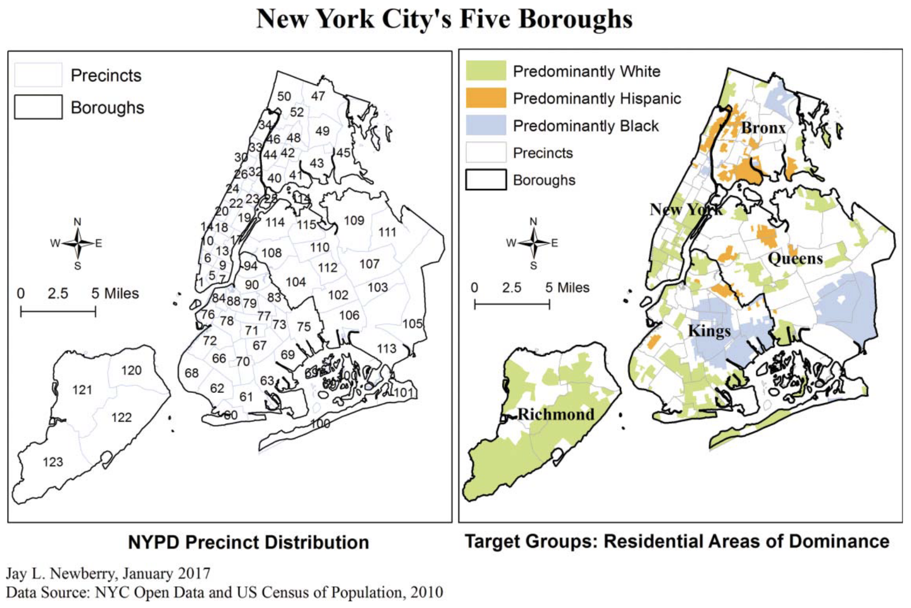

# Data

## NYPD Stop, Question and Frisk Data

This dataset is provided by the [New York Police Department](https://www.nyc.gov/site/nypd/stats/reports-analysis/stopfrisk.page) and contains information about the stop, question, and frisk policy implemented by the NYPD. The data can be found at `/r-data/nypd-stop`

## NYC Crime Data

-   [NYPD Shooting Incident Data (Historic)](): List of every shooting incident that occurred in NYC going back to 2006 through the end of the previous calendar year.
-   [NYPD Complaint Data (Historic)](): List all valid felony, misdemeanor, and violation crimes reported to the New York City Police Department (NYPD) from 2006 to the end of last year
-   [NYPD Arrest Data (Historic)](): List of every arrest in NYC going back to 2006 through the end of the previous calendar year.
-   Misdemeanor Counts by Precinct: List of major misdemeanor crime statistics for each NYPD precinct.
-   Major Felony Counts by Precinct: List of major felony crime statistics for each NYPD precinct.

## NYC GIS Data

-   [NYC Borough Boundaries](): Shapefile data for the five boroughs of New York City.
-   [NYPD Precinct Boundaries](): Shapefile data for the 77 NYPD precincts in New York City.
-   [U.C.S. Census Tracts for New York City](): Shapefile data for the census tracts in New York City.

## NYC Census Data

-   [NYC Census Data by Precinct (2020)](): Census data for New York City broken down by NYPD precincts from the 2020 U.S. Census.

# Setup

`setup.R` contains the code to load and preprocess the datasets used in this analysis -- NYPD stop and crime data, NYC GIS data, and US Census data.

```{r setup, include=FALSE}

# check to see if the setup has already been run, if not, run it
# this includes the NYPD crime and SQF data and R libraries 
if (!exists(".setup_complete") || !.setup_complete) {
      source("setup.R")
    } else {
      message("setup.R has already been run.")
    }

# check to see if the GIS setup has already been run, if not, run it
if (!exists(".setup_complete_gis") || !.setup_complete_gis) {
      source("setup.R")
    } else {
      message("gis.R has already been run.")
    }

# check to see if the Census setup has already been run, if not, run it
# `census.R` depends on `gis.R` being run first
if (!exists(".setup_complete_census") || !.setup_complete_census) {
      source("census.R")
    } else {
      message("census.R has already been run.")
    }

```

# Descriptive Statistics

```{r}

# summary statistics for numeric variables in sqf_hist
sqfSummary <- sqf_hist %>%
  select(where(is.numeric)) %>%
  summary()
print(sqfSummary)

# stop breakdown, by race and arrest rate
stopsByRace <- sqf_hist %>% 
  filter(YEAR2 == 2024) %>%
  group_by(SUSPECT_RACE_DESCRIPTION) %>%
  count() %>%
  ungroup()

```

```{r}

# total annual stops 2020-2024
# overall number of recorded stops per year, need to eventually refactor with older data
d1 <- sqf_hist %>%
  filter(YEAR2 >= 2020) %>%
  group_by(YEAR2) %>%
  summarise(count = n()) %>%
  ggplot(aes(x = YEAR2, y = count)) +
  geom_area(fill = "steelblue", alpha = 0.6) +
  geom_line(color = "steelblue") +
  labs(
    title = "Total Annual Stops: 2020 - 2024",
    x = "Year",
    y = "Stops"
  ) +
  geom_vline(aes(xintercept = 2022),
             color="blue", linetype="dashed")
  theme_minimal()

# arrest conversions, BWH
# calculates total stops, frisks, searches, and arrests by race
# graphs proportion of stops that did NOT result in arrest.
d2 <- sqf_hist %>%
  filter(SUSPECT_RACE_DESCRIPTION %in% BWH) %>%
  group_by(SUSPECT_RACE_DESCRIPTION) %>%
  summarize(stops = n(),
            frisk = sum(FRISKED_FLAG == "Y", na.rm = TRUE),
            search = sum(SEARCHED_FLAG == "Y", na.rm = TRUE),
            arrest = sum(SUSPECT_ARRESTED_FLAG == "Y", na.rm = TRUE)) %>%
  mutate(non_arrest_rate = round(arrest / stops, 4)) %T>%
  print() %>%
  ggplot(aes(y = 1 - non_arrest_rate, 
             x = SUSPECT_RACE_DESCRIPTION,
             fill = SUSPECT_RACE_DESCRIPTION)) +
  geom_col() +
  coord_cartesian(ylim = c(0.5, 0.75)) +
  scale_fill_viridis_d(option = "magma") +
  labs(
    x = "Suspect Race",
    y = "% of Stops with No Arrest",
    fill = "Race",
    title = "No Arrest from Stops: 2020 - 2024"
  ) +
  theme_minimal()

# group percentage of stops, BWH
d3 <- sqf_hist %>%
  group_by(SUSPECT_RACE_DESCRIPTION) %>%
  summarize(count = n()) %>%
  ungroup() %>%
  mutate(prop = round(count / sum(count), 4)) %>%
  filter(SUSPECT_RACE_DESCRIPTION %in% BWH) %T>%
  print() %>%
  ggplot(aes(x = SUSPECT_RACE_DESCRIPTION,
             y = prop,
             fill = SUSPECT_RACE_DESCRIPTION)) +
  geom_col() +
  scale_fill_viridis_d(option = "magma") +
  labs(x = "Race",
       y = "Proportion of Stops",
       title = "Group Percentage of Stops: 2020 - 2024",
       fill = "Race")

# stop initiation, BWH
# how stops were initiated (e.g., witness, radio run, self-initiated)
d4 <- sqf_hist %>%
  group_by(SUSPECT_RACE_DESCRIPTION, STOP_WAS_INITIATED) %>%
  summarize(count = n()) %>%
  ungroup() %>%
  group_by(STOP_WAS_INITIATED) %>%
  mutate(prop_init = round(count / sum(count), 4)) %>%
  filter(SUSPECT_RACE_DESCRIPTION %in% BWH) %>%
  pivot_wider(names_from = STOP_WAS_INITIATED,
              values_from = c(count, prop_init)) %T>%
  print() %>%
  pivot_longer(
    cols = starts_with("prop_init_"),
    names_to = "STOP_WAS_INITIATED",
    names_prefix = "prop_init_",
    values_to = "prop_init"
  ) %>%
  ggplot(aes(
    x = STOP_WAS_INITIATED,,
    y = prop_init,
    fill = SUSPECT_RACE_DESCRIPTION
  )) +
  geom_col(position = "stack") +
  scale_fill_viridis_d(option = "magma", direction = -1) +
  labs(
    title = "Percentage of Stop Initiation by Suspect Race",
    x = "Suspect Race",
    y = "Proportion",
    fill = "Race"
  ) +
  scale_x_discrete(labels = c(
    "Based on C/W on Scene" = "Witness on Scene",
    "Based on Radio Run" = "Radio Run",
    "Based on Self Initiated" = "Self-Initiated"
  )) +
  theme_minimal() +
  theme(
    axis.text.x = element_text(angle = 15, hjust = 1)
  )

d5 <- grid.arrange(d1, d2, d3, d4, nrow = 2)

```

# Spatial Analysis

## NYPD Precincts

```{r create map of nypd precincts}

# plot the NYPD map
nypdMAP <- ggplot(nypd_sf) +
  geom_sf(fill = "white", color = "black", linewidth = 0.3) +
  theme_void()

```

## NYC's Five Boroughs



> “\[The above\] figure presents a map of the study area broken down by precinct and bolstered by areas of racial and ethnic dominance based on census figures indicating residential percentages greater than 70 percent for the Hispanic, non-Hispanic black, and non-Hispanic white populations.” ([Newberry, 2017, p. 313](zotero://select/library/items/3GQF23RV)) ([pdf](zotero://open-pdf/library/items/ZD4QYXA7?page=7&annotation=FVYBVE4H))

```{r}

# NYC Precinct Distribution
# NYC map with Precincts and Boroughs
# with Boro lines and precint overlays, including the number of the precinct
pct_bounds <- ggplot() +
    geom_sf(data = nypd_sf, fill = NA, color = "grey70", size = 0.8) +
    geom_sf(data = nyc_sf, fill = NA, color = "black", linewidth = 0.3) + 
    theme_void()

pct_bounds + geom_sf_text(data = nypd_sf, aes(label = Precinct), size = 2, color = "blue")
  

# NYC Residential Dominance
# NYC map with precinct boundaries and Census Tracts
# Color census tract wherein one BWH makes up 70 percent of the population
p1 <- nyc_census2020_trc %>%
  select(!c("american_indian_alone","asian_alone", "pacific_islander_alone", "population_one_race", "some_other_race_alone", "two_or_more_races")) %>%
  mutate(
    white_share = white_alone / total_population,
    black_share = black_alone / total_population,
    hisp_share  = hispanic_or_latino / total_population,
    
    prod_group = case_when(
      white_share >= 0.7 ~ "Predominantly White",
      black_share >= 0.7 ~ "Predominantly Black",
      hisp_share  >= 0.7 ~ "Predominantly Hispanic",
      TRUE ~ "No Predominant Group"
    ))
  
p1 <- st_transform(p1, st_crs(nyc_sf))
p1 <- st_intersection(p1, nyc_sf)
  
  p1 %>% ggplot() +
  geom_sf(aes(fill = prod_group), color = "grey70", linewidth = 0.1) +
  scale_fill_manual(
    values = c(
      "Predominantly White" = "greenyellow",
      "Predominantly Black" = "dodgerblue",
      "Predominantly Hispanic" = "darkorange",
      "No Predominant Group" = "white"
    ),
    name = "Majority Group"
  ) +
  geom_sf(data = nyc_sf, fill = NA, color = "black", linewidth = 0.3) + 
  labs(
    title = "Target Groups: Residential Areas of Dominance",
    caption = "Source: 2020 Decennial Census (PL 94-171)"
  ) +
  theme_void()
```
